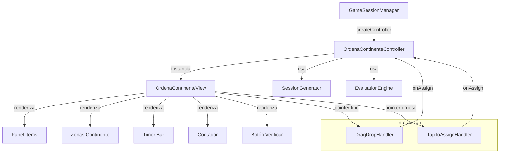
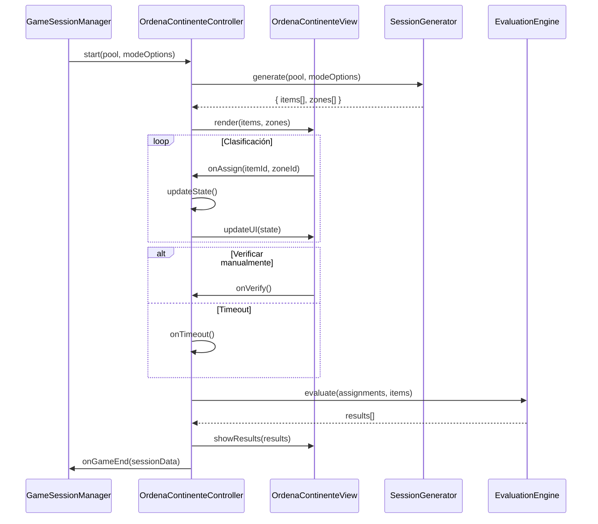

# Design Document: Ordena por Continente

## Overview

"Ordena por Continente" es un modo de juego individual de clasificación donde el jugador asigna banderas o capitales a sus continentes correspondientes. A diferencia de los modos existentes basados en preguntas secuenciales (FlagRush, CapitalClash, StreakBlitz), este modo presenta todos los ítems simultáneamente y el jugador los distribuye libremente entre zonas de continente antes de verificar.

El modo soporta dos mecanismos de interacción: drag-and-drop en escritorio y tap-to-assign en móvil. La evaluación es batch (todos los ítems a la vez) en lugar de por ronda individual.

### Decisiones de diseño clave

1. **Sesión de ronda única**: A diferencia de FlagRush (N rondas secuenciales), este modo es una sola "ronda" con múltiples ítems. El `roundHistory` contendrá un único registro con el resultado agregado.
2. **Sin scoring engine/streak**: La puntuación es porcentual (correctos/total), no basada en tiempo de respuesta ni rachas. No se integra con ScoringEngine ni StreakService.
3. **Dual interaction**: Se detecta el tipo de pointer al inicio y se habilita solo el mecanismo apropiado (drag vs tap).
4. **Estado inmutable post-evaluación**: Una vez verificado, el estado se congela y se muestra retroalimentación.

## Architecture



### Flujo de datos



## Components and Interfaces

### OrdenaContinenteController

```javascript
/**
 * Controller principal del modo "Ordena por Continente".
 * Sigue la interfaz IModeController: start(), stop(), destroy().
 */
class OrdenaContinenteController {
    constructor({ container, onRoundEnd, onGameEnd })
    
    // Interfaz pública (IModeController)
    start(pool, modeOptions)    // Inicia sesión con pool filtrado y opciones
    stop()                       // Detiene sin disparar onGameEnd
    destroy()                    // Limpia DOM y listeners
    
    // Estado público
    roundHistory                 // Array con resultado de la sesión
    
    // Métodos internos
    _generateSession(pool, modeOptions)  // Genera ítems y zonas
    _handleAssign(itemId, zoneId)        // Procesa asignación
    _handleUnassign(itemId)              // Devuelve ítem al panel
    _handleReassign(itemId, newZoneId)   // Mueve entre zonas
    _handleVerify()                      // Ejecuta evaluación
    _handleTimeout()                     // Evaluación por timeout
    _startTimer(seconds)                 // Inicia temporizador
}
```

### OrdenaContinenteView

```javascript
/**
 * View dedicada para renderizar la interfaz de clasificación.
 * Responsable de DOM, eventos de interacción y feedback visual.
 */
class OrdenaContinenteView {
    constructor(container)
    
    render(items, zones, options)         // Renderiza UI completa
    updateItemState(itemId, state)        // Actualiza estado visual de un ítem
    moveItemToZone(itemId, zoneId)        // Anima ítem hacia zona
    moveItemToPanel(itemId)               // Devuelve ítem al panel
    updateCounter(pending, total)         // Actualiza contador
    setVerifyEnabled(enabled)             // Habilita/deshabilita botón
    showResults(results)                  // Muestra retroalimentación
    showSummary(summary)                  // Muestra resumen final
    updateTimer(remaining, total)         // Actualiza barra de progreso
    destroy()                             // Limpia DOM
    
    // Callbacks (inyectados por controller)
    onAssign(itemId, zoneId)
    onUnassign(itemId)
    onReassign(itemId, newZoneId)
    onVerify()
}
```

### SessionGenerator (función pura)

```javascript
/**
 * Genera la distribución de ítems para una sesión.
 * Función pura: mismos inputs → misma estructura (salvo aleatoriedad).
 */
function generateSession(pool, modeOptions) → {
    items: Array<{ id, countryId, continent, flagUrl, capital, displayValue }>,
    zones: Array<{ id, continent, label }>
}
```

### EvaluationEngine (función pura)

```javascript
/**
 * Evalúa las asignaciones del jugador contra los datos reales.
 * Función pura: determinista dado assignments + items.
 */
function evaluate(assignments, items) → {
    results: Array<{ itemId, assignedZone, correctZone, isCorrect }>,
    score: number,          // 0-100 entero
    correct: number,
    incorrect: number
}
```

### DragDropHandler

```javascript
/**
 * Maneja eventos de drag-and-drop nativos del navegador.
 * Solo se instancia en dispositivos con pointer fino.
 */
class DragDropHandler {
    constructor(container, { onDragStart, onDrop, onDragCancel })
    enable()
    disable()
    destroy()
}
```

### TapToAssignHandler

```javascript
/**
 * Maneja la interacción tap-to-assign para dispositivos táctiles.
 * Gestiona el estado de selección de ítems.
 */
class TapToAssignHandler {
    constructor(container, { onSelect, onAssign, onDeselect })
    enable()
    disable()
    destroy()
    getSelectedItemId() → string|null
}
```

## Data Models

### GameItem

```javascript
/**
 * Representa un ítem clasificable en la sesión.
 */
{
    id: string,              // UUID único para la sesión
    countryId: string,       // Referencia al país en flags.json
    continent: string,       // Continente real (para evaluación)
    flagUrl: string,         // URL de la bandera SVG
    capital: string,         // Nombre de la capital en español
    displayValue: string,    // Valor a mostrar (flagUrl o capital según config)
    displayType: 'flag'|'capital'  // Tipo de visualización
}
```

### ZoneState

```javascript
/**
 * Estado de una zona de continente durante la sesión.
 */
{
    id: string,              // Identificador de la zona
    continent: string,       // Nombre del continente
    label: string,           // Etiqueta para mostrar (español)
    assignedItems: string[]  // IDs de ítems asignados
}
```

### SessionState (interno del controller)

```javascript
/**
 * Estado completo de la sesión de clasificación.
 */
{
    items: GameItem[],
    zones: ZoneState[],
    assignments: Map<string, string>,  // itemId → zoneId
    pendingItems: Set<string>,         // IDs de ítems sin asignar
    isEvaluated: boolean,
    startTime: number,
    timerEnabled: boolean,
    timeLimit: number|null,            // segundos, null si sin tiempo
    results: EvaluationResult|null
}
```

### ModeOptions para "ordenaContinente"

```javascript
// Registro en MODE_OPTIONS
{
    ordenaContinente: [
        { id: 'itemCount', label: 'Cantidad de ítems', type: 'number', default: 12, min: 6, max: 24 },
        { id: 'continents', label: 'Continentes', type: 'multiSelect', options: [
            { value: 'Africa', label: 'África' },
            { value: 'America', label: 'América' },
            { value: 'Asia', label: 'Asia' },
            { value: 'Europe', label: 'Europa' },
            { value: 'Oceania', label: 'Oceanía' },
        ], default: ['Africa', 'America', 'Asia', 'Europe', 'Oceania'] },
        { id: 'itemType', label: 'Tipo de ítem', type: 'select', options: [
            { value: 'flags', label: '🏳️ Banderas' },
            { value: 'capitals', label: '🏛️ Capitales' },
        ], default: 'flags' },
        { id: 'timerMode', label: 'Temporizador', type: 'select', options: [
            { value: 'off', label: '♾️ Sin tiempo' },
            { value: 'on', label: '⏱️ Con tiempo' },
        ], default: 'off' },
        { id: 'timeLimit', label: 'Tiempo límite (s)', type: 'number', default: 120, min: 30, max: 300,
          _conditionalOn: { id: 'timerMode', value: 'on' } },
    ]
}
```

### Registro en GAME_MODES

```javascript
ordenaContinente: {
    id: 'ordenaContinente',
    name: 'Ordena por Continente',
    icon: '🌍',
    category: 'individual',
    description: 'Clasifica banderas o capitales en su continente'
}
```

## Correctness Properties

*A property is a characteristic or behavior that should hold true across all valid executions of a system — essentially, a formal statement about what the system should do. Properties serve as the bridge between human-readable specifications and machine-verifiable correctness guarantees.*

### Property 1: Minimum continents validation

*For any* subset of continents with fewer than 2 elements selected, the system SHALL disable the start action and prevent session initialization.

**Validates: Requirements 2.6**

### Property 2: Max items adjusts to available sovereign countries

*For any* selection of continents, the maximum allowed item count SHALL equal the total number of sovereign countries available across those selected continents in the dataset.

**Validates: Requirements 2.7**

### Property 3: Pool distribution invariants

*For any* valid configuration (itemCount, selectedContinents), the generated session pool SHALL contain exactly itemCount items, all with Sovereign_State === "Yes", with no duplicate countries, and each selected continent SHALL have at least floor(itemCount / numContinents) items (or all available sovereign countries if fewer exist).

**Validates: Requirements 3.1, 3.2, 3.3**

### Property 4: Assignment state consistency

*For any* item assignment to a zone, the item SHALL be removed from the pending set, added to the zone's assigned list, the pending counter SHALL equal (total - number of assigned items), and the rendered zones SHALL match exactly the selected continents.

**Validates: Requirements 4.2, 4.3, 4.4, 4.5**

### Property 5: Verify button tracks completion state

*For any* game state, the "Verificar respuestas" button SHALL be disabled if and only if there exist items in the pending set (pendingItems.size > 0), and enabled if and only if all items have been assigned (pendingItems.size === 0).

**Validates: Requirements 4.7, 4.8**

### Property 6: Unassignment restores pending state

*For any* previously assigned item, unassigning it SHALL return it to the pending set, remove it from its zone's assigned list, and increment the pending counter by 1.

**Validates: Requirements 7.1, 7.2**

### Property 7: Evaluation correctness

*For any* set of item-to-zone assignments, the evaluation SHALL mark an item as correct if and only if its assigned zone's continent matches the item's actual Continent field, and for each incorrect item SHALL report the correct continent name.

**Validates: Requirements 8.1, 8.5**

### Property 8: Score calculation

*For any* evaluation result with `correct` items out of `total` items (where 0 ≤ correct ≤ total and total > 0), the score SHALL equal Math.round((correct / total) * 100), producing an integer between 0 and 100 inclusive.

**Validates: Requirements 8.3**

### Property 9: Evaluation locks interaction

*For any* game state before evaluation, all items SHALL be reassignable without limit. *For any* game state after evaluation, no item SHALL be reassignable (all assignment/unassignment operations SHALL be no-ops).

**Validates: Requirements 7.4, 8.6**

### Property 10: Timeout marks unclassified items as incorrect

*For any* set of unclassified items when the timer expires, all unclassified items SHALL be counted as incorrect in the evaluation, and the score SHALL reflect only the items that were correctly classified before timeout.

**Validates: Requirements 9.2, 9.3**

### Property 11: ARIA roles consistency

*For any* rendered game state, the Panel_Ítems SHALL have role="list", each item SHALL have role="listitem", and each Zona_Continente SHALL have role="region" with an aria-label containing the continent name and the count of assigned items.

**Validates: Requirements 12.1**

### Property 12: Aria-live announcements on state changes

*For any* item assignment or unassignment action, the system SHALL update an aria-live="polite" region with a message identifying the item and the action performed (assigned to zone X, or returned to panel).

**Validates: Requirements 12.4**

## Error Handling

| Escenario | Comportamiento |
|-----------|---------------|
| Pool vacío o insuficiente | Controller invoca `onGameEnd` con score 0 y muestra mensaje de error en la view |
| Flag_URL no carga (imagen rota) | Fallback a texto con nombre del país (Country_Spanish) |
| Capital_Spanish vacío o "Desconocida" | Excluir país del pool durante generación |
| Drag API no soportada | Fallback automático a tap-to-assign |
| Timer llega a 0 durante drag activo | Cancelar drag en curso, ejecutar evaluación con estado actual |
| Pérdida de foco/visibilidad (tab switch) | Pausar timer si está activo, reanudar al volver |
| Container DOM removido externamente | `destroy()` verifica existencia antes de manipular DOM |

## Testing Strategy

### Unit Tests (example-based)

- **Configuration**: Verificar registro en GAME_MODES y MODE_OPTIONS con valores correctos
- **BottomSheet integration**: Verificar que el BottomSheet muestra opciones con defaults
- **Conditional options**: Verificar que "Tiempo límite" aparece solo cuando timer = "on"
- **View rendering**: Verificar grid responsive, zonas, contador, botón
- **Drag-and-drop**: Verificar feedback visual (opacidad, highlight, revert)
- **Tap-to-assign**: Verificar selección, deselección, cambio de selección
- **Reassignment**: Verificar drag entre zonas sin pasar por panel
- **Timer**: Verificar renderizado de barra, auto-evaluación al expirar
- **Visual feedback**: Verificar colores correcto/incorrecto post-evaluación
- **Design system**: Verificar uso de tokens CSS (fonts, colors, shadows, radii)
- **Reduced motion**: Verificar duration: 0ms con prefers-reduced-motion
- **Keyboard navigation**: Verificar Tab, Enter/Space, flechas
- **Focus management**: Verificar foco al botón cuando no quedan ítems

### Property-Based Tests (vitest + fast-check)

Cada propiedad del documento se implementa como un test con mínimo 100 iteraciones:

- **Property 1**: Generar subsets de continentes de tamaño 0 y 1, verificar start deshabilitado
- **Property 2**: Generar selecciones aleatorias de continentes, verificar max = sovereign count
- **Property 3**: Generar configs aleatorias (itemCount, continents), verificar invariantes de distribución
- **Property 4**: Generar secuencias aleatorias de asignaciones, verificar consistencia de estado
- **Property 5**: Generar estados aleatorios con distintas cantidades de ítems pendientes, verificar estado del botón
- **Property 6**: Generar asignaciones y luego desasignar aleatoriamente, verificar restauración
- **Property 7**: Generar asignaciones aleatorias (correctas e incorrectas), verificar evaluación
- **Property 8**: Generar pares (correct, total) aleatorios, verificar cálculo de score
- **Property 9**: Generar secuencias de acciones pre y post evaluación, verificar lock
- **Property 10**: Generar estados parcialmente clasificados, simular timeout, verificar resultado
- **Property 11**: Generar estados aleatorios, verificar ARIA roles en DOM
- **Property 12**: Generar acciones de asignación/desasignación, verificar aria-live

**Librería PBT**: `fast-check` (ya compatible con vitest)

**Configuración**: Cada test ejecuta mínimo 100 iteraciones.

**Tag format**: `Feature: sort-by-continent, Property {N}: {description}`

### Integration Tests

- GameSessionManager crea OrdenaContinenteController correctamente
- Ciclo completo: start → assign all → verify → onGameEnd con datos correctos
- endSession() invoca stop() y reporta resultados parciales
