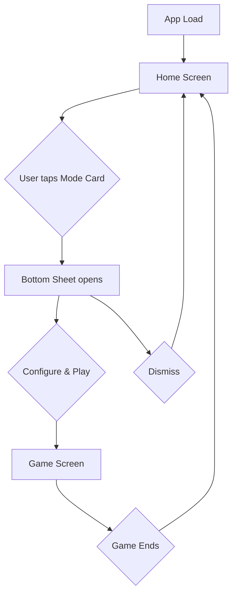
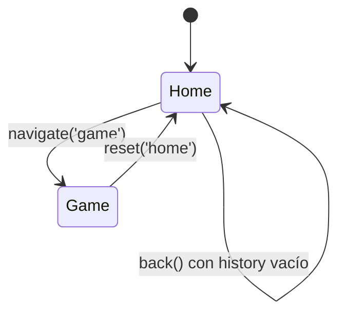
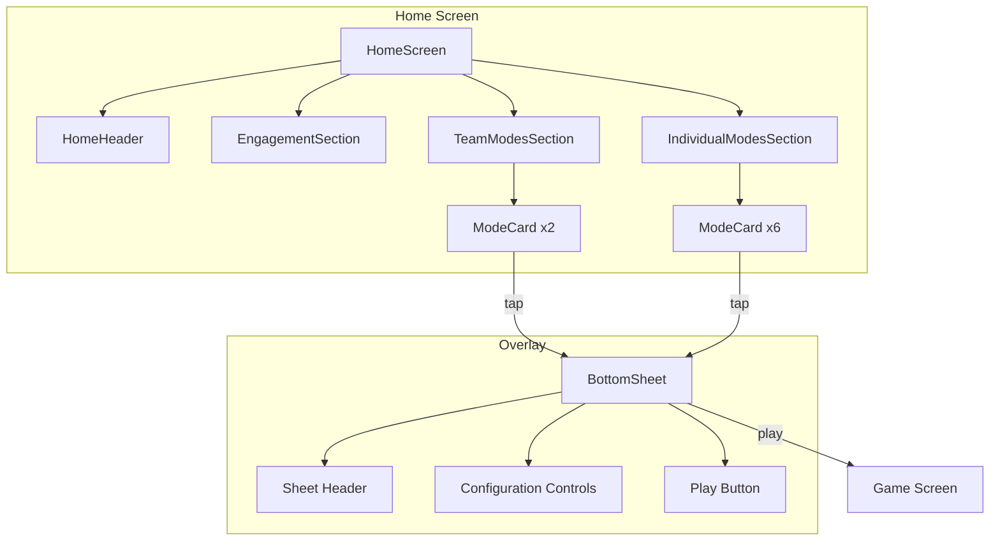

# Design Document: UX Game Modes Redesign

## Overview

Este rediseño transforma la experiencia de navegación de la aplicación Flag Quiz, eliminando las pantallas intermedias (Landing Hero, Mode Selector, Parametrization) y consolidando todo en un flujo de dos pantallas: **Home** y **Game**. La Pantalla Home actúa como hub central mostrando los modos de juego directamente, mientras que un Bottom Sheet proporciona configuración rápida sin navegación adicional.

### Decisiones de Diseño Clave

1. **Hub-and-Spoke Pattern**: La Home es el hub central; cada modo de juego es un spoke accesible con un tap.
2. **Progressive Disclosure**: La configuración se revela bajo demanda via Bottom Sheet, no en pantalla separada.
3. **Reducción de fricción**: De 4 pantallas (Landing → Mode Selector → Parametrization → Game) a 2 (Home → Game) con Bottom Sheet inline.
4. **Reutilización de lógica existente**: La lógica de filtrado y configuración de `ParametrizationView` se migra al Bottom Sheet sin cambios funcionales.

### Diagrama de Flujo



## Architecture

### Restructuración del AppRouter

El `AppRouter` se simplifica de 4 pantallas a 2:



**Antes:**
```js
static SCREENS = ['landing', 'modeSelector', 'parametrization', 'game'];
```

**Después:**
```js
static SCREENS = ['home', 'game'];
```

El AppRouter mantiene su arquitectura existente (show/hide containers, body class management, history stack, custom events) pero con la lista reducida de pantallas y integración con History API del navegador.

### Arquitectura de Componentes



### Patrón MVC Aplicado

| Capa | Componente | Responsabilidad |
|------|-----------|-----------------|
| **View** | `HomeView` | Renderiza la Pantalla Home completa |
| **View** | `ModeCardView` | Renderiza una tarjeta de modo individual |
| **View** | `BottomSheetView` | Renderiza y gestiona el panel de configuración |
| **View** | `EngagementSectionView` | Renderiza estadísticas del usuario |
| **Model** | `ModeDefinition.js` | Registro de modos (sin cambios) |
| **Model** | `GameState.js` | Estado del juego (sin cambios) |
| **Controller** | `main.js` | Orquesta navegación y ciclo de vida |
| **Service** | `StatsService` | Datos de engagement (sin cambios) |
| **Service** | `CountryService` | Filtrado de países (sin cambios) |

## Components and Interfaces

### 1. AppRouter (Refactorizado)

```js
/**
 * AppRouter v2: manages screen transitions for Home ↔ Game flow.
 * Integrates with browser History API for back-button support.
 */
export class AppRouter {
    static SCREENS = ['home', 'game'];
    static BODY_CLASS_PREFIX = 'screen-';

    constructor() {
        this.currentScreen = 'home';
        this.history = [];
        this.containers = {};
        this._cacheContainers();
        this._applyScreen('home');
        this._initPopstateListener();
    }

    navigate(screen, params = {}) { /* push to history, pushState, apply */ }
    back() { /* pop history or stay on home */ }
    reset(screen = 'home', params = {}) { /* clear history, apply */ }
    getCurrentScreen() { return this.currentScreen; }
    canGoBack() { return this.history.length > 0; }

    // Private
    _cacheContainers() {
        this.containers = {
            home: document.getElementById('homeScreen'),
            game: document.querySelector('.game-wrapper'),
        };
    }
    _applyScreen(screen) { /* hideAll, show target, update body class */ }
    _initPopstateListener() {
        window.addEventListener('popstate', (e) => {
            if (this.currentScreen === 'game') {
                this.reset('home');
            }
        });
    }
    _dispatchNavigationEvent(screen, params) { /* CustomEvent 'app:navigate' */ }
}
```

### 2. HomeView

```js
/**
 * Renders the complete Home screen: header, engagement, mode sections.
 * Created once on app init, updated when navigating back to home.
 */
export class HomeView {
    constructor({ container, statsService, countryService, onModeSelect }) {}
    
    render() { /* builds full home screen DOM */ }
    update() { /* refreshes engagement data without full re-render */ }
    destroy() { /* cleanup */ }
}
```

### 3. ModeCardView

```js
/**
 * Renders a single mode card with icon, name, description, and category badge.
 * Handles keyboard and pointer interactions.
 */
export class ModeCardView {
    constructor({ mode, onSelect }) {}
    
    render() { /* returns HTMLElement */ }
    
    // Returns structured element:
    // <article role="button" tabindex="0" aria-label="{name} — {category}: {description}">
    //   <span class="mode-card__icon" aria-hidden="true">{emoji}</span>
    //   <h3 class="mode-card__name">{name}</h3>
    //   <p class="mode-card__description">{description}</p>
    //   <span class="mode-card__badge mode-card__badge--{category}">{categoryLabel}</span>
    // </article>
}
```

### 4. BottomSheetView

```js
/**
 * Modal bottom sheet for quick game configuration.
 * Implements focus trap, escape-to-close, swipe-to-dismiss.
 * Remembers last configuration per mode via localStorage.
 */
export class BottomSheetView {
    static STORAGE_KEY = 'flagquiz_mode_config_';
    
    constructor({ countryService, onPlay, onDismiss }) {}
    
    open(modeId) { /* animate in, render config, trap focus */ }
    close() { /* animate out, restore focus, cleanup */ }
    
    // Private
    _renderConfig(modeId) { /* builds filter + mode-specific controls */ }
    _loadSavedConfig(modeId) { /* from localStorage */ }
    _saveConfig(modeId, config) { /* to localStorage */ }
    _buildConfig() { /* returns config object compatible with startGame() */ }
    _initFocusTrap() { /* trap Tab within sheet */ }
    _initSwipeDismiss() { /* touch gesture to close */ }
    _updatePlayButtonState() { /* disable if pool < 5 */ }
}
```

### 5. EngagementSectionView

```js
/**
 * Renders user engagement stats: streak, last mode played, global progress.
 * Positioned above mode sections in the Home screen.
 */
export class EngagementSectionView {
    constructor({ statsService, countryService, onQuickPlay }) {}
    
    render() { /* returns HTMLElement with stats */ }
    update() { /* refresh stats without full re-render */ }
}
```

### Interfaces y Contratos

```typescript
// Config object passed from BottomSheet to startGame (same as current ParametrizationView)
interface GameConfig {
    modeId: string;
    continent: string;           // 'All' | 'Africa' | 'America' | 'Asia' | 'Europe' | 'Oceania'
    sovereigntyStatus: string;   // 'All' | 'Yes' | 'No'
    maxCount: number;
    modeOptions: Record<string, any>;
    practiceMode?: boolean;      // team modes only
    randomOrder?: boolean;       // team modes only
}

// Navigation event detail (unchanged)
interface NavigationEventDetail {
    screen: 'home' | 'game';
    params: Record<string, any>;
}
```

## Data Models

### Estado de Configuración por Modo (localStorage)

Cada modo almacena su última configuración bajo la clave `flagquiz_mode_config_{modeId}`:

```json
{
    "continent": "All",
    "sovereigntyStatus": "All",
    "maxCount": null,
    "modeOptions": {
        "timePerQuestion": 10,
        "rounds": 10
    },
    "practiceMode": false,
    "randomOrder": true
}
```

### Datos de Engagement (existentes en StatsService)

No se modifican los modelos de datos existentes. La `EngagementSectionView` consume:

| Dato | Fuente | Método |
|------|--------|--------|
| Racha actual | `StatsService` | `getStats().currentStreak` |
| Último modo jugado | `StatsService` | `getStats().lastPlayedDate` + `modeStats` |
| Banderas únicas acertadas | `StatsService` | `getStats().uniqueCountriesCorrect.length` |
| Total banderas | `CountryService` | `countries.length` |

### Registro de Modos (sin cambios)

El `GAME_MODES` en `src/models/ModeDefinition.js` permanece idéntico. La categorización team/individual se lee del campo `category`.

### Opciones de Modo por Tipo (migrado de ParametrizationView)

La constante `MODE_OPTIONS` se extrae a un módulo compartido `src/models/ModeOptions.js` para ser consumida tanto por el BottomSheet como por cualquier otro componente que necesite conocer las opciones disponibles por modo:

```js
export const MODE_OPTIONS = {
    flagRush: [
        { id: 'timePerQuestion', label: 'Tiempo por pregunta (s)', type: 'number', default: 10, min: 5, max: 30 },
        { id: 'rounds', label: 'Número de rondas', type: 'number', default: 10, min: 5, max: 50 },
    ],
    // ... (same structure as current ParametrizationView)
};
```

