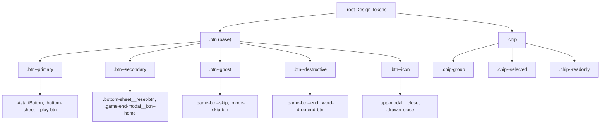

# Design Document: UX/UI Improvements — FlagQuiz

## Overview

Este documento describe el diseño técnico para homologar y unificar la interfaz de usuario de FlagQuiz. El objetivo es establecer un sistema de componentes coherente basado en design tokens CSS, un Button System semántico de cinco variantes, y estilos consistentes para todos los componentes interactivos: Game Header, Bottom Sheet, Chips, MC_Option, Team Counter, modales, Mode Cards y Landing Page.

La aplicación está construida con JavaScript vanilla y arquitectura MVC. Todo el sistema de diseño reside en `assets/styles/styles.css` con tokens CSS en `:root`. Las vistas son clases JS que generan DOM dinámicamente (`BottomSheetView`, `GameEndModalView`, `MultipleChoiceView`, `ModeCardView`, etc.).

### Decisiones de diseño clave

- **Sin nuevas dependencias de CSS**: el sistema de diseño se implementa exclusivamente con CSS custom properties y clases utilitarias.
- **Backward-compatible**: los tokens existentes (`--cream-bg`, `--sage`, `--space-md`, etc.) se preservan sin modificación; solo se añaden los nuevos tokens de botón.
- **Chips sobre selects**: las opciones con 2–4 valores se reemplazan por chips para reducir la fricción de interacción y el espacio vertical.
- **Compacidad sin sacrificar accesibilidad**: todas las reducciones de tamaño respetan el mínimo táctil de 44×44px (WCAG 2.5.5).
- **PBT library**: [fast-check](https://fast-check.dev/) para property-based testing con Vitest.

---

## Architecture

La arquitectura de implementación sigue tres capas:

```
assets/styles/styles.css
  └── :root { Design Tokens (nuevos --btn-h-*, --btn-px-*, --btn-fs-*) }
        └── .btn (base) → .btn--primary / --secondary / --ghost / --destructive / --icon
        └── .chip → .chip--selected / .chip--readonly
        └── .chip-group

src/views/
  ├── BottomSheetView.js   → _renderChipGroup() para opciones con 2-4 valores
  ├── GameEndModalView.js  → chips de solo lectura para opciones jugadas
  ├── ModeCardView.js      → .mode-card con tokens actualizados
  ├── MultipleChoiceView.js → .mc-option con nuevas dimensiones
  └── (otros views)        → variantes .btn--* en lugar de clases ad-hoc
```

### Diagrama de dependencias de tokens



---

## Components and Interfaces

### 1. Design Token System

Se añaden los siguientes tokens al bloque `:root` existente en `assets/styles/styles.css`, inmediatamente después de los tokens de tipografía. Los tokens existentes no se modifican.

```css
/* BUTTON SYSTEM TOKENS */
--btn-h-xs: 28px;
--btn-h-sm: 32px;
--btn-h-md: 36px;
--btn-h-lg: 40px;
--btn-h-xl: 44px;

--btn-px-sm: 12px;
--btn-px-md: 16px;
--btn-px-lg: 24px;
--btn-px-xl: 32px;

--btn-fs-sm: 0.72rem;
--btn-fs-md: 0.82rem;
--btn-fs-lg: 0.9rem;
```

### 2. Button System

**Clase base `.btn`:**

```css
.btn {
  display: inline-flex;
  align-items: center;
  justify-content: center;
  gap: 6px;
  padding: 0 var(--btn-px-md);
  border-radius: var(--radius-pill);
  font-family: var(--font-body);
  font-weight: 600;
  letter-spacing: 0.03em;
  cursor: pointer;
  border: none;
  transition: background-color var(--duration-quick) var(--ease-gentle),
              color var(--duration-quick) var(--ease-gentle),
              border-color var(--duration-quick) var(--ease-gentle),
              transform var(--duration-quick) var(--ease-gentle),
              box-shadow var(--duration-quick) var(--ease-gentle);
}
.btn:disabled { opacity: 0.45; cursor: not-allowed; pointer-events: none; }
.btn:focus-visible { outline: 2px solid var(--deep-sage); outline-offset: 2px; }
@media (prefers-reduced-motion: reduce) {
  .btn { transition: background-color 120ms, color 120ms, border-color 120ms; }
  .btn:hover, .btn:active { transform: none; box-shadow: none; }
}
```

**Variantes semánticas:**

| Clase | Uso | Height | Background | Color |
|---|---|---|---|---|
| `.btn--primary` | Acción principal | `var(--btn-h-lg)` = 40px | `var(--deep-sage)` | `var(--warm-white)` |
| `.btn--secondary` | Acción secundaria | `var(--btn-h-md)` = 36px | transparent | `var(--deep-sage)` |
| `.btn--ghost` | Acción terciaria | `var(--btn-h-sm)` = 32px | transparent | `var(--stone)` |
| `.btn--destructive` | Acción peligrosa | `var(--btn-h-sm)` = 32px | transparent | `var(--rust)` |
| `.btn--icon` | Solo icono | 32×32px | `var(--soft-sand)` | `var(--charcoal)` |

`.btn--secondary` usa `border: 1.5px solid var(--deep-sage)`.
`.btn--ghost` usa `border: 1px solid transparent`.
`.btn--destructive` usa `border: 1px solid rgba(160, 75, 56, 0.4)`.
`.btn--icon` es circular (`border-radius: 50%`, `width: 32px`, `height: 32px`, `padding: 0`).
`.btn--destructive:focus-visible` usa `outline-color: var(--rust)`.

### 3. Chip Component

```css
.chip {
  height: var(--btn-h-sm);
  padding: 0 var(--btn-px-sm);
  border-radius: var(--radius-pill);
  font-size: var(--btn-fs-sm);
  font-weight: 600;
  border: 1.5px solid var(--warm-gray);
  background: var(--warm-white);
  color: var(--stone);
  cursor: pointer;
  transition: background 120ms ease, border-color 120ms ease, color 120ms ease;
  display: inline-flex;
  align-items: center;
  white-space: nowrap;
}
.chip--selected { background: var(--soft-sand); border-color: var(--deep-sage); color: var(--deep-sage); }
.chip:focus-visible { outline: 2px solid var(--deep-sage); outline-offset: 2px; }
.chip--readonly { pointer-events: none; cursor: default; }
.chip-group { display: flex; flex-wrap: wrap; gap: var(--space-xs); }
```

**Interfaz JavaScript de ChipGroup** (en `BottomSheetView._renderChipGroup`):

```javascript
_renderChipGroup(opt, currentValue) {
  const defaultValue = currentValue ?? opt.default ?? opt.options[0]?.value;
  const group = document.createElement('div');
  group.className = 'chip-group';
  group.setAttribute('role', 'group');
  group.setAttribute('aria-label', opt.label);

  for (const o of opt.options) {
    const chip = document.createElement('button');
    chip.type = 'button';
    chip.className = 'chip' + (o.value === defaultValue ? ' chip--selected' : '');
    chip.textContent = o.label;
    chip.dataset.value = o.value;
    chip.setAttribute('aria-pressed', String(o.value === defaultValue));
    chip.addEventListener('click', () => {
      this.modeOptions[opt.id] = o.value;
      group.querySelectorAll('.chip').forEach(c => {
        c.classList.toggle('chip--selected', c.dataset.value === o.value);
        c.setAttribute('aria-pressed', String(c.dataset.value === o.value));
      });
    });
    chip.addEventListener('keydown', (e) => {
      if (e.key === 'Enter' || e.key === ' ') { e.preventDefault(); chip.click(); }
    });
    group.appendChild(chip);
  }
  return group;
}
```

Condición para usar chips en lugar de `<select>`:
```javascript
const useChips = opt.type === 'select' && opt.options.length >= 2 && opt.options.length <= 4;
```

### 4. Game_Header (compactación)

Cambios en `.game-header`:
- `padding`: de `var(--space-lg) var(--space-xl)` → `var(--space-sm) var(--space-md)` (8px vertical)
- `max-height`: 52px en desktop (`min-width: 768px`), 44px en mobile

Cambios en `.game-header h1`:
- `font-size`: de `1.5rem` → `1.1rem`
- Añadir: `white-space: nowrap; overflow: hidden; text-overflow: ellipsis; max-width: 200px`

Los botones `#startButton`, `.game-btn--skip`, `.game-btn--end` adoptan las clases `.btn` + variante correspondiente.

### 5. Bottom_Sheet (compactación + chips)

Cambios en `.bottom-sheet`:
- `max-height: 70vh; overflow-y: auto`
- `padding: var(--space-sm) var(--space-md) var(--space-md)`

Layout de dos columnas para filtros (>320px):
```css
@media (min-width: 321px) {
  .bottom-sheet__filters-grid {
    display: grid;
    grid-template-columns: 1fr 1fr;
    gap: var(--space-sm);
  }
}
```

Controles de formulario: `height: var(--btn-h-sm)` (32px).

### 6. MC_Option (compactación)

Cambios en `.mc-option`:
- `min-height: 44px` (reducido de ~52px, mantiene mínimo táctil WCAG)
- `font-size: 0.85rem`
- `border-radius: var(--radius-md)`
- `border: 2px solid var(--warm-gray)`

Estados de feedback:
- `.mc-option--correct`: `border-color: var(--deep-sage)`, `background: rgba(74, 122, 80, 0.12)`, `color: var(--deep-sage)`
- `.mc-option--incorrect`: `border-color: var(--rust)`, `background: rgba(160, 75, 56, 0.12)`, `color: var(--rust)`

Icono de feedback `.mc-option__icon`: `font-size: 1em; margin-left: 0.25em`.

### 7. Team_Counter (compactación)

Cambios en `#redCounter, #blueCounter, #greenCounter`:
- `min-height`: de 90px → 72px (desktop), de 80px → 60px (mobile)
- Score `font-size`: de `2.4rem` → `2rem` (desktop), de `2rem` → `1.8rem` (mobile)
- Label: `font-size: 0.6rem`, `font-weight: 800`, `text-transform: uppercase`, `letter-spacing: 0.1em`
- `:hover`: `transform: translateY(-4px)`, `box-shadow: 0 8px 24px rgba(28, 25, 23, 0.15)`, `transition: transform 150ms ease, box-shadow 150ms ease`
- `:active`: `transform: translateY(-2px) scale(1.02)`

Atributos ARIA añadidos en JavaScript:
```javascript
counter.setAttribute('aria-label', `${teamName}: ${score} puntos`);
counter.setAttribute('aria-live', 'polite');
counter.setAttribute('aria-atomic', 'true');
```

### 8. Modal Unification (App_Modal base)

Estructura HTML unificada para todos los modales:

```html
<div class="app-modal__backdrop" data-close="true"></div>
<div class="app-modal__panel">
  <header class="app-modal__header">
    <h2 class="app-modal__title">...</h2>
    <button class="btn btn--icon app-modal__close" aria-label="Cerrar">✕</button>
  </header>
  <div class="app-modal__body">...</div>
  <footer class="app-modal__footer">...</footer>
</div>
```

CSS base:
```css
.app-modal__panel { max-width: 440px; border-radius: var(--radius-xl); border: 1px solid var(--warm-gray); box-shadow: var(--shadow-lifted); }
.app-modal__header { padding: var(--space-md) var(--space-lg); border-bottom: 1px solid var(--soft-sand); }
.app-modal__body { padding: var(--space-md) var(--space-lg); overflow-y: auto; max-height: 85vh; }
```

`Game_End_Modal` sobreescribe: `max-width: 400px`.
`Settings_Modal` usa footer con `.btn--ghost` (Cancelar) + `.btn--primary` (Guardar).

Comportamiento de cierre:
- Click en backdrop → `close()`
- Tecla Escape → `close()` + restaurar foco al elemento disparador
- Al abrir → foco al primer elemento interactivo

### 9. Game Area Layout (compactación global)

| Componente | Antes | Después |
|---|---|---|
| Game_Header height | ~60px | max 52px desktop / 44px mobile |
| Timer_Bar height | 6px | 4px |
| Round_Progress height | 6px | 4px |
| Streak_Indicator min-height | 40px | 32px |
| Power_Up_Button | 44px / 38px | 36px / 32px |

### 10. Game Mode Headers (consistencia)

Todos los headers de modo (`.flag-rush-header`, `.capital-clash-header`, `.streak-blitz-header`, `.supervivencia-header`, `.geo-puzzle-header`) se unifican con:
- Padding: `var(--space-xs) var(--space-sm)`
- Score: `font-family: var(--font-display)`, `font-size: var(--fs-score)` (1.5rem), `font-weight: 600`
- Progress: `font-family: var(--font-body)`, `font-size: var(--fs-body)` (0.9rem), `color: var(--stone)`
- Lives: `font-size: 1rem`, `letter-spacing: 1px`

### 11. Landing Page y Mode_Cards

**Landing_Mode_Card**:
```css
.landing-mode-card { padding: 8px var(--space-sm); border-radius: var(--radius-md); border: 1.5px solid var(--soft-sand); gap: 2px; }
.landing-mode-card__icon { font-size: 1.2rem; }
.landing-mode-card__name { font-size: 0.72rem; font-weight: 600; color: var(--charcoal); }
.landing-mode-card:active { transform: scale(0.97); transition: transform 150ms ease; }
.landing-mode-card:focus-visible { outline: 2px solid var(--deep-sage); outline-offset: 2px; }
```

**Mode_Card**:
```css
.mode-card { padding: var(--space-lg); border-radius: var(--radius-lg); gap: var(--space-sm); box-shadow: var(--shadow-soft); }
.mode-card__badge--team { background: var(--sage); color: var(--warm-white); }
.mode-card__badge--individual { background: var(--ocean); color: var(--warm-white); }
.mode-card__badge { font-size: 0.6rem; padding: 2px var(--space-xs); }
.mode-card:focus-visible { outline: 3px solid var(--deep-sage); outline-offset: 2px; }
.mode-card:hover { transform: translateY(-2px); box-shadow: var(--shadow-lifted); transition: transform 150ms ease, box-shadow 150ms ease; }
```

---

## Data Models

No se introducen nuevos modelos de datos. Los cambios son puramente de presentación (CSS + HTML generado por las vistas).

**Interfaz de opción de modo** (existente en `src/models/ModeOptions.js`):
```typescript
interface ModeOption {
  id: string;
  label: string;
  type: 'select' | 'number';
  default: string | number;
  options?: Array<{ value: string; label: string }>; // solo para type='select'
  min?: number;
  max?: number;
}
```

La condición `opt.type === 'select' && opt.options.length >= 2 && opt.options.length <= 4` determina si se renderiza un `ChipGroup` o un `<select>`.

---


---

## Correctness Properties

*Una propiedad es una característica o comportamiento que debe mantenerse verdadero en todas las ejecuciones válidas de un sistema — esencialmente, una declaración formal sobre lo que el sistema debe hacer. Las propiedades sirven como puente entre las especificaciones legibles por humanos y las garantías de corrección verificables por máquina.*

Esta feature involucra lógica de renderizado de componentes (BottomSheetView, MultipleChoiceView, GameEndModalView) y reglas CSS universales que se aplican a todos los elementos de una clase. Ambas categorías son adecuadas para property-based testing: las reglas CSS son invariantes que deben mantenerse para cualquier instancia del componente, y la lógica de renderizado produce salidas verificables a partir de entradas variables.

**Librería PBT**: [fast-check](https://fast-check.dev/) con Vitest. Mínimo 100 iteraciones por propiedad (`{ numRuns: 100 }`).

---

### Property 1: Disabled state es consistente en todas las variantes de botón

*Para cualquier* variante de botón (`.btn--primary`, `.btn--secondary`, `.btn--ghost`, `.btn--destructive`, `.btn--icon`), cuando el elemento tiene el atributo `disabled`, debe tener `opacity: 0.45` y `cursor: not-allowed`, independientemente de la variante específica.

**Validates: Requirements 2.7**

---

### Property 2: Focus-visible outline es consistente en variantes no-destructivas

*Para cualquier* variante de botón que no sea `.btn--destructive`, cuando el elemento recibe foco mediante `:focus-visible`, debe mostrar `outline: 2px solid var(--deep-sage)` con `outline-offset: 2px`. Para `.btn--destructive`, el outline debe usar `var(--rust)` como color.

**Validates: Requirements 2.8**

---

### Property 3: Chips de selección son mutuamente excluyentes dentro de un grupo

*Para cualquier* grupo de chips (`.chip-group`) con N chips (2 ≤ N ≤ 4), al seleccionar el chip en el índice i, exactamente ese chip debe tener la clase `chip--selected` y `aria-pressed="true"`, y todos los demás chips del grupo deben tener `aria-pressed="false"` y no tener la clase `chip--selected`.

**Validates: Requirements 5.3**

---

### Property 4: El chip del valor por defecto está seleccionado al abrir el BottomSheet

*Para cualquier* opción de modo renderizada como chips, cuando el `BottomSheetView` se abre, el chip cuyo `data-value` coincide con el valor por defecto de la opción (`opt.default`) debe tener la clase `chip--selected` y `aria-pressed="true"`.

**Validates: Requirements 5.4**

---

### Property 5: Opciones con 2-4 valores se renderizan como chips, no como select

*Para cualquier* definición de opción de modo con `type === 'select'` y entre 2 y 4 valores en `opt.options`, el `BottomSheetView` debe renderizar un `.chip-group` con chips en lugar de un elemento `<select>`. Para opciones con más de 4 valores, debe renderizar un `<select>`.

**Validates: Requirements 4.7**

---

### Property 6: Selección correcta de MC_Option aplica estilos de feedback correcto

*Para cualquier* opción de respuesta múltiple marcada como correcta (`data-correct="true"`), al seleccionarla, el botón debe recibir la clase `mc-option--correct` y contener un elemento `.mc-option__icon` con el texto `✓`.

**Validates: Requirements 6.4, 6.6**

---

### Property 7: Selección incorrecta de MC_Option aplica estilos de feedback incorrecto

*Para cualquier* opción de respuesta múltiple marcada como incorrecta (`data-correct="false"`), al seleccionarla, el botón debe recibir la clase `mc-option--incorrect` y contener un elemento `.mc-option__icon` con el texto `✗`. Adicionalmente, la opción correcta del mismo grupo debe recibir la clase `mc-option--correct`.

**Validates: Requirements 6.5, 6.6**

---

### Property 8: Cerrar modal con Escape restaura el foco al elemento disparador

*Para cualquier* modal abierto (App_Modal, Game_End_Modal, Settings_Modal), al presionar la tecla Escape, el modal debe cerrarse y el foco debe retornar al elemento que tenía el foco antes de que el modal se abriera.

**Validates: Requirements 8.7**

---

### Property 9: Abrir un modal mueve el foco al primer elemento interactivo

*Para cualquier* modal, inmediatamente después de abrirse, `document.activeElement` debe ser el primer elemento interactivo dentro del panel del modal (botón de cierre o primer campo de formulario).

**Validates: Requirements 8.8**

---

### Property 10: Click en backdrop cierra el modal

*Para cualquier* modal abierto, hacer click en el elemento backdrop (`.app-modal__backdrop` con `data-close="true"`) debe invocar el método `close()` del modal.

**Validates: Requirements 8.6**

---

### Property 11: Encabezados de modo de juego tienen tipografía consistente

*Para cualquier* selector de encabezado de modo (`.flag-rush-header`, `.capital-clash-header`, `.streak-blitz-header`, `.supervivencia-header`, `.geo-puzzle-header`), el elemento de puntuación debe usar `font-family: var(--font-display)` y `font-size: var(--fs-score)`, y el elemento de progreso debe usar `font-family: var(--font-body)` y `color: var(--stone)`.

**Validates: Requirements 10.3, 10.4**

---

### Property 12: Botones icon-only tienen aria-label

*Para cualquier* elemento con la clase `btn--icon` presente en el DOM, debe tener un atributo `aria-label` no vacío que describa la acción del botón.

**Validates: Requirements 12.2**

---

### Property 13: Team counters tienen atributos ARIA correctos

*Para cualquier* elemento Team_Counter renderizado con un nombre de equipo y una puntuación, debe tener `aria-live="polite"`, `aria-atomic="true"`, y un atributo `aria-label` con el formato `"[Nombre del equipo]: [puntuación] puntos"`.

**Validates: Requirements 12.5**

---

### Property 14: Reduced motion elimina animaciones de transform y box-shadow

*Para cualquier* variante de botón, chip o tarjeta interactiva, dentro del bloque `@media (prefers-reduced-motion: reduce)`, los estados `:hover` y `:active` no deben contener propiedades `transform` ni `box-shadow`, y la `transition` debe limitarse a `background-color`, `color` y `border-color` con duración máxima de 120ms.

**Validates: Requirements 12.3**

---

### Property 15: Componentes interactivos tienen área táctil mínima de 44px

*Para cualquier* componente interactivo (botones, chips, mode cards, MC options), el valor de `min-height` en el CSS debe ser al menos 44px en dispositivos táctiles, garantizando el área táctil mínima recomendada por WCAG 2.5.5.

**Validates: Requirements 6.3, 12.6**

---

**Reflexión de propiedades (eliminación de redundancias):**

- Properties 6 y 7 son complementarias (correcto vs. incorrecto) y ambas incluyen la verificación del icono de feedback (req. 6.6) — no hay redundancia, cada una cubre un caso distinto.
- Properties 8 y 9 cubren aspectos distintos del ciclo de vida del modal (cierre vs. apertura).
- Properties 3 y 4 cubren aspectos distintos del comportamiento de chips (exclusividad mutua vs. estado inicial).
- Property 5 subsume los casos específicos de requirements 5.5 y 5.6, que son ejemplos de la regla general.
- Properties 1 y 2 cubren estados distintos del botón (disabled vs. focus-visible).

No se identifican propiedades redundantes. Las 15 propiedades proveen cobertura única y complementaria.

---

## Error Handling

### CSS Token Missing / Fallback

Si un token CSS no está definido, los navegadores usan el valor inicial de la propiedad. Para mitigar esto, los tokens de botón se declaran al inicio del bloque `:root`, antes de cualquier selector que los referencie.

### Chip Group — Opción sin valor por defecto

Si una opción de modo no tiene `default` definido, el `BottomSheetView` selecciona el primer chip del grupo como estado inicial:

```javascript
const defaultValue = currentValue ?? opt.default ?? opt.options[0]?.value;
```

### Modal — Elemento disparador sin foco

Si `document.activeElement` es `document.body` cuando se abre un modal, el foco se restaura a `document.body` al cerrar, que es el comportamiento correcto del navegador.

### BottomSheet — Pool de países insuficiente

Si el pool filtrado tiene menos de 5 países, el botón de jugar se deshabilita y se muestra el mensaje de advertencia con `color: var(--rust)` y `font-size: var(--fs-body-sm)`. Este comportamiento ya existe y se preserva.

### Chip — Tecla Enter/Space en chip ya seleccionado

Si el usuario presiona Enter o Space sobre un chip ya seleccionado, el chip permanece seleccionado (no se deselecciona). Los chips son de selección única obligatoria, no toggles.

---

## Testing Strategy

### Enfoque dual: Unit Tests + Property-Based Tests

**Framework**: Vitest (ya configurado en el proyecto).
**PBT Library**: [fast-check](https://fast-check.dev/) — `npm install --save-dev fast-check`.
**Configuración PBT**: mínimo 100 iteraciones por propiedad (`{ numRuns: 100 }`).
**Tag format**: `// Feature: ux-ui-improvements, Property N: [texto de la propiedad]`

### Unit Tests (tests de ejemplo)

Los unit tests cubren los criterios clasificados como EXAMPLE:

1. **Design Token presence** — parsear `styles.css` y verificar que cada token de botón existe en `:root` con el valor exacto especificado (Req. 1.1–1.4, 1.6).
2. **Button variant CSS** — verificar que cada variante `.btn--*` tiene las propiedades CSS correctas (Req. 2.1–2.6, 2.9).
3. **Game_Header state** — renderizar el header en estado pre-juego y en-juego, verificar visibilidad de botones (Req. 3.1–3.6).
4. **Bottom_Sheet layout** — verificar max-height, overflow, y layout de dos columnas (Req. 4.1–4.6).
5. **Modal structure** — verificar que `GameEndModalView` y `SettingsModal` usan la estructura base de `App_Modal` (Req. 8.1–8.5).
6. **Team_Counter gradients** — verificar gradientes de fondo por equipo (Req. 7.7).
7. **Mode_Card badges** — verificar colores de badge por categoría (Req. 11.5–11.6).

### Property-Based Tests (fast-check)

Cada propiedad del diseño se implementa con un único test de propiedad:

```javascript
import fc from 'fast-check';
import { test, expect } from 'vitest';

// Feature: ux-ui-improvements, Property 3: Chips de selección son mutuamente excluyentes
test('chip group: selecting one chip deselects all others', () => {
  fc.assert(fc.property(
    fc.integer({ min: 2, max: 4 }),
    fc.nat(),
    (numChips, rawIndex) => {
      const selectedIndex = rawIndex % numChips;
      const options = Array.from({ length: numChips }, (_, i) => ({
        value: `opt${i}`, label: `Opción ${i}`
      }));
      const opt = { id: 'test', label: 'Test', type: 'select', default: 'opt0', options };
      const view = new BottomSheetView(/* ... */);
      const group = view._renderChipGroup(opt, 'opt0');
      const chips = group.querySelectorAll('.chip');
      chips[selectedIndex].click();
      chips.forEach((chip, i) => {
        expect(chip.classList.contains('chip--selected')).toBe(i === selectedIndex);
        expect(chip.getAttribute('aria-pressed')).toBe(String(i === selectedIndex));
      });
    }
  ), { numRuns: 100 });
});
```

```javascript
// Feature: ux-ui-improvements, Property 6: Selección correcta aplica feedback correcto
test('mc-option: selecting correct answer applies correct feedback', () => {
  fc.assert(fc.property(
    fc.integer({ min: 0, max: 3 }),
    fc.array(fc.string({ minLength: 1, maxLength: 30 }), { minLength: 4, maxLength: 4 }),
    (correctIndex, texts) => {
      const options = texts.map((text, i) => ({ text, correct: i === correctIndex }));
      const container = document.createElement('div');
      const view = new MultipleChoiceView({ container });
      view.render(options, () => {});
      const buttons = container.querySelectorAll('.mc-option');
      buttons[correctIndex].click();
      expect(buttons[correctIndex].classList.contains('mc-option--correct')).toBe(true);
      const icon = buttons[correctIndex].querySelector('.mc-option__icon');
      expect(icon).not.toBeNull();
      expect(icon.textContent).toContain('✓');
    }
  ), { numRuns: 100 });
});
```

### Integration Tests

Los criterios que requieren entorno de navegador se cubren con Playwright:

- **Layout sin scroll a 375×667px** (Req. 9.6): verificar `document.body.scrollHeight <= window.innerHeight`.
- **Contraste de color** (Req. 12.1): auditoría con axe-core o Lighthouse.

### Cobertura por requisito

| Requisito | Criterios | Tipo de test |
|---|---|---|
| Req. 1 | 1.1–1.4, 1.6 | Unit (CSS parsing) |
| Req. 1 | 1.5 | Smoke (visual) |
| Req. 2 | 2.1–2.6, 2.9 | Unit |
| Req. 2 | 2.7, 2.8 | Property 1, 2 |
| Req. 3 | 3.1–3.6 | Unit + Example |
| Req. 4 | 4.1–4.6 | Unit + Example |
| Req. 4 | 4.7 | Property 5 |
| Req. 5 | 5.1–5.2, 5.5–5.7 | Unit + Example |
| Req. 5 | 5.3, 5.4, 5.8 | Property 3, 4, 2 |
| Req. 6 | 6.1–6.3 | Unit |
| Req. 6 | 6.4–6.6 | Property 6, 7 |
| Req. 7 | 7.1–7.4, 7.7 | Unit |
| Req. 7 | 7.5, 7.6 | Property (CSS :hover/:active) |
| Req. 8 | 8.1–8.5 | Unit |
| Req. 8 | 8.6–8.8 | Property 8, 9, 10 |
| Req. 9 | 9.1–9.5 | Unit |
| Req. 9 | 9.6 | Integration (Playwright) |
| Req. 10 | 10.1–10.5 | Property 11 |
| Req. 11 | 11.1–11.2, 11.5–11.6 | Unit |
| Req. 11 | 11.3, 11.4, 11.7, 11.8 | Property (CSS states) |
| Req. 12 | 12.1 | Integration (axe-core) |
| Req. 12 | 12.2, 12.3, 12.4, 12.5, 12.6 | Property 12, 14, 2, 13, 15 |
